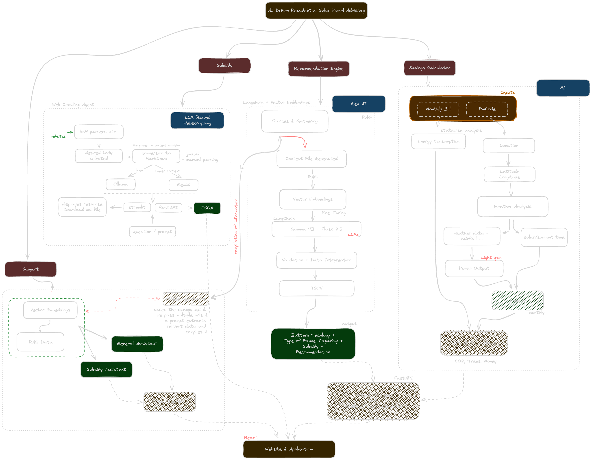

# Solar Helper: AI-Driven Decision Platform for Residential Solar Adoption

**Solar Helper** is an intelligent, data-driven platform designed to accelerate the adoption of residential solar energy in India. It addresses the critical information gap faced by homeowners by providing personalized recommendations, accurate financial analysis, and direct access to subsidy information, all powered by a sophisticated AI and Machine Learning backend.

This project was developed as part of the Bachelor of Technology program at Jaypee Institute of Information Technology, Noida.

[](https://www.python.org/)
[](https://fastapi.tiangolo.com/)
[](https://reactjs.org/)
[](https://lightgbm.readthedocs.io/)

## Table of Contents

- [The Problem](#-the-problem)
- [The Solution](#-the-solution)
- [Key Features](#-key-features)
- [System Architecture](#️-system-architecture)
- [Tech Stack](#-tech-stack)
- [Getting Started](#-getting-started)
  - [Prerequisites](#prerequisites)
  - [Installation](#installation)
- [Usage](#-usage)
- [Future Scope](#-future-scope)

## The Problem

Despite ambitious government initiatives like the **Pradhan Mantri Surya Ghar Yojana (PMSGY)** aiming for 30 GW of residential solar capacity, adoption remains slow. Homeowners are often hindered by:

- **Information Asymmetry:** A lack of clear, personalized data on potential savings, costs, and payback periods.
- **Financial Uncertainty:** Confusion around complex and varying subsidy schemes (central and state).
- **Technical Complexity:** Difficulty in choosing the right panel capacity, technology, and battery backup system.
- **Infrastructural Hurdles:** Delays in net metering and supply chain issues.

## The Solution

**Solar Helper** tackles these challenges head-on. It's a one-stop web platform that leverages Machine Learning and Geospatial analysis to empower users. By simply providing their monthly electricity bill and location, users receive a comprehensive, AI-generated report tailored to their specific needs, helping them make confident and informed decisions.

## Key Features

- **Savings Calculator:** Instantly estimates monthly, annual, and 25-year savings, along with your potential carbon offset.
- **AI Recommendation Engine:** A multi-step process that analyzes your location, energy needs, property size, and budget to recommend:
  - Optimal Solar Panel Capacity (kW)
  - Panel Technology (e.g., Monocrystalline)
  - Battery System (Type, Capacity, Backup Duration)
  - Detailed Cost and Subsidy Breakdown
- **Subsidy Navigator:** Automatically calculates and explains applicable central (PMSGY) and state-specific subsidies.
- **Energy Yield Prediction:** Utilizes a `LightGBM` model trained on historical weather and solar irradiance data to forecast monthly power generation with **81% accuracy**.
- **Dual AI Chat Support:**
  - **Subsidy Expert:** A specialized chatbot fine-tuned on government policies to answer all subsidy-related questions.
  - **General Expert:** A helpful assistant for general queries about solar technology, maintenance, and benefits.
- **LLM-Powered Web Scraping:** A sophisticated RAG (Retrieval-Augmented Generation) pipeline keeps our subsidy and policy data up-to-date by intelligently scraping and understanding information from government portals.
- **Progressive Web App (PWA):** Fully responsive and installable on mobile devices for a native app-like experience.

## System Architecture

The platform is built on a monolithic backend with a decoupled frontend. The core logic revolves around three main data flows: the Savings Calculator, the Recommendation Engine, and the Support Chat, all powered by a combination of ML models and LLM-driven agents.



## Tech Stack

| Category             | Technologies                                                                                                               |
| -------------------- | -------------------------------------------------------------------------------------------------------------------------- |
| **Frontend**         | `React.js`, `TailwindCSS`, `Framer Motion`                                                                                 |
| **Backend**          | `Python`, `FastAPI`                                                                                                        |
| **AI / ML**          | `LightGBM` (Power Prediction), `LangChain`, `Gemini`, `Ollama` (LLMs for RAG & Chat), `Sentence-Transformers` (Embeddings) |
| **Data Processing**  | `Beautiful Soup 4`, `Scrapy` (for web scraping)                                                                            |
| **Databases**        | Vector Database (e.g., ChromaDB, FAISS - for RAG)                                                                          |
| **Deployment/Infra** | PWA configuration, `Uvicorn`                                                                                               |

## Getting Started

To get a local copy up and running, follow these simple steps.

### Prerequisites

- Python 3.10+
- Node.js v18+ and npm
- An API key from Google for the Gemini model.

### Installation

1.  **Clone the repository:**

    ```sh
    git clone https://github.com/your-username/solar-helper.git
    cd solar-helper
    ```

2.  **Setup the Backend:**

    ```sh
    cd backend

    # Create and activate a virtual environment
    python -m venv venv
    source venv/bin/activate  # On Windows use `venv\Scripts\activate`

    # Install dependencies
    pip install -r requirements.txt

    # Create a .env file and add your API key
    echo "GEMINI_API_KEY='YOUR_API_KEY_HERE'" > .env
    ```

3.  **Setup the Frontend:**

    ```sh
    cd ../frontend

    # Install dependencies
    npm install
    ```

## Usage

1.  **Run the Backend Server:**
    From the `backend` directory, start the FastAPI server:

    ```sh
    uvicorn main:app --reload
    ```

    The API will be available at `http://127.0.0.1:8000`.

2.  **Run the Frontend Application:**
    From the `frontend` directory, start the React development server:
    ```sh
    npm start
    ```
    Open [http://localhost:3000](http://localhost:3000) to view it in your browser.

## Future Scope

The current platform lays a strong foundation. Future enhancements could include:

- **Advanced Yield Modeling:** Revisit LSTM or explore Transformer-based models with more granular weather data for even higher prediction accuracy.
- **Smart Meter Integration:** Allow users to connect their smart meter data (with consent) for hyper-personalized consumption profiles and recommendations.
- **Predictive Maintenance:** Monitor the performance of installed systems and send alerts for cleaning or potential issues.
- **Peer-to-Peer Energy Trading:** For grid-connected users, suggest models for selling excess power to neighbors, potentially integrated with blockchain for transparency.
